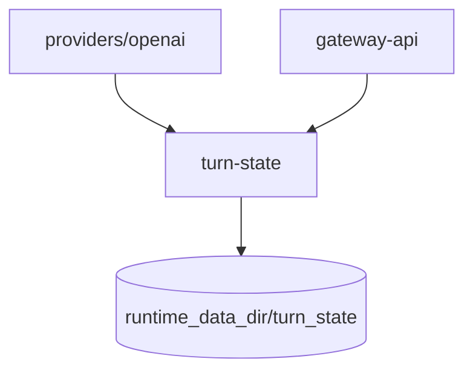

# fork 架构增补

本文只记录本 fork 相对上游 [`docs/architecture.md`](../architecture.md) 新增的组件与不变量。
合并上游时 `docs/architecture.md` 直接取上游版本，fork 的变化只改本文。

## 组件

| crate / 模块 | 职责 |
| --- | --- |
| `turn-state` | Codex `X-Codex-Turn-State` 模板的桶存储（账号 × 模型，落运行数据目录）、Fernet 到期、注入决策、观测统计；纯逻辑 + 文件，不依赖其它 workspace crate，由 `providers/openai` 在请求前/响应后两处钩子调用，管理接口由 `gateway-api` 直接持有服务句柄 |
| `gateway-admin::ops_report` + `gateway-store::postgres::ops_report` | 经营日报：定时按北京时间自然日汇总 CPR 号池投入与只读 sub2api 库的消费、收款，快照落 `runtime_data_dir/ops_report/daily.json`；买入成本每轮按票据现状校正全部日期 |
| `gateway-admin::use_case::public_import` | 免登录导入入口（按号商多配置），配置落 `runtime_data_dir/public_import/` |
| 账号票据（fork 迁移 9003/9004） | 账号成本、到期、AES-256-GCM 加密登录票据与自动复活计数；「已过期」目录状态只存在于管理目录，不进入调度五态 |

## 计量

Provider 上报费用优先于本地估算作为既有结算金额；模型计算费用同时独立保留，不能冒充真实上游费用。
父表 `model_requests` 持久化入口请求模型、路由模型与上游实际响应模型（`upstream_response_model`）；
实际计价模型与本地计算费用存入子表 `model_request_billing`（fork 迁移 9001，避免 ALTER 巨表）。
最终响应与计价观测在重试前一并清空，丢弃的 attempt 不得污染最终计量。

## Provider 执行不变量补充

- Provider 的一次 `execute` 只选择一个 credential 并返回一个冷流；换号、通用重试和 fallback 由 Core 决定。
  OpenAI 密文恢复仅在该次执行内处理明确拒绝，受下述 Provider 恢复边界约束。
- OpenAI Provider 对明确的 `invalid_encrypted_content` 拒绝提供一次同账号、同凭据、同模型恢复，
  仅在尚未交付客户端事件、未观察到输出或工具活动，且输入可自含重放时移除加密 reasoning 项。
  普通消息和配对工具历史保持原样；引用、compaction、孤儿工具结果及未知历史项继续要求客户端重放。
  正常请求保留密文。已拒绝项的摘要只在有界进程缓存中保存，按账号、凭据代际、模型、Client Key 与
  客户端会话隔离，供后续请求预清理；缺少客户端会话时只允许本次恢复。恢复不改变 Core 的结算合同，
  也不证明被拒绝的上游请求免费。

## 状态归属补充

请求日志总开关与测试 Key 属于 Core 的 `SettingsValues`，随 RuntimeSnapshot 冻结并投影到 RoutingPlan
请求设置重编译复用上游的统一编译路径，模型映射等其他覆盖不应重置日志门控
设置服务的 SDK 合同从宿主类型生成并包含 fork 日志字段，使用该服务的插件应使用匹配本 fork 的 SDK 构建

| 状态 | 归属 | 说明 |
| --- | --- | --- |
| OpenAI 实验 state 固定开关 / 候选 | PostgreSQL 凭据 JSON / Provider 进程内有界缓存 | 开关持久化；候选不落盘，最多 2048 条、固定一小时，按账号、令牌指纹、捕获代次、模型和客户端密钥隔离 |
| turn-state 模板、自动续期参数 | `runtime_data_dir/turn_state/` | 蓝绿实例共享；票值永不经管理接口返回 |
| 经营日报快照、免登录导入配置、票据密钥 | `runtime_data_dir/` 下各自目录 | 不进数据库和备份 |

## Worker 补充

- Provider：OpenAI 可选的签名号池 401 复活（`openai-oauth-revive`）复用 `OAuthRefresh` 类别，默认关闭；
  cloud mint 续票、WS 暖池 warmer 与上游的定时账号预热（默认关闭）并存。
- Admin：经营日报 `ops-daily-report`（10 分钟一轮，跨实例租约）、票据自动复活。

WS 预热的候选审批由 Provider 持有，发布凭证由请求构造、转发任务和连接池共享
连接回池时仍不可被业务领养，完整验证及路由条件发布完成后才开放复用
匹配保留账号、握手画像、模型和实际路由约束，专用代理候选另外绑定创建时的账号业务出口身份
审批凭证同时持有最近验证时间、有限有效期、票据指纹和包含账号绑定代次的探针策略指纹；调度器直接读取凭证决定复探，不另外维护验证时钟
已领用连接不承载后台探针，新对话复用前重新核对证明；不满足时重新选连接，已有续接保留其协议路径并返回真实的过期观测
失败候选不写入账号票据，复探或取消会撤销可复用资格，已有业务连接遵循其原来的续接生命周期
发布前复用票据服务的格式和有效期校验；保存票失败时，仅在凭据 revision 仍属于本次提交的情况下恢复原路由，保留并发提交的新配置
配置和接口规则见 [连接预热](api.md#连接预热)
